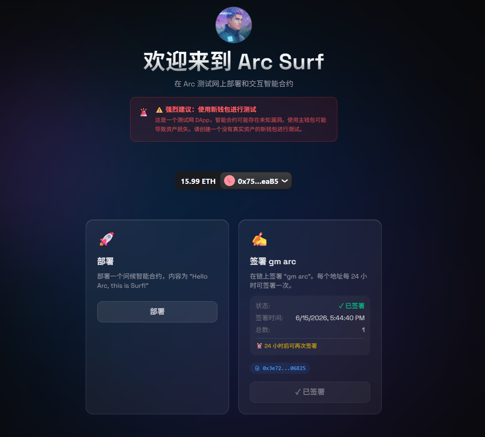

# 🏄 Arc Surf

> A sleek, modern DApp for interacting with smart contracts on the Arc Testnet.

<div align="center">


[](https://opensource.org/licenses/MIT)

</div>

## ✨ Features

- 🔗 **Multi-Wallet Support** - Connect with OKX Wallet, MetaMask, Rabby, and more via RainbowKit
- 🚀 **1-Click Deploy** - Deploy smart contracts directly from the browser
- ✍️ **Daily Sign-In** - Sign "gm arc" on-chain once every 24 hours
- 🌐 **Bilingual UI** - Seamless English/Chinese language switching
- 🎨 **Modern Design** - Dark theme with ambient glow effects and glassmorphism
- 📱 **Responsive** - Works on desktop and mobile browsers

## 🚀 Demo

**Live on Arc Testnet:** [https://arc-surf-19d0be.surf.computer](https://arc-surf-19d0be.surf.computer)

## 📸 Screenshots

<div align="center">
  
</div>

## 🛠️ Tech Stack

| Category | Technology |
|----------|------------|
| Frontend | React 19, TypeScript, Vite 6 |
| Styling | Tailwind CSS 4, CSS Variables |
| Web3 | wagmi, viem, RainbowKit |
| State | React Query, React Context |
| i18n | Custom implementation with browser detection |

## 📦 Installation

```bash
# Clone the repository
git clone https://github.com/YOUR_USERNAME/arc-surf.git
cd arc-surf

# Install dependencies
cd frontend
npm install

# Start development server
npm run dev
```

## 🔧 Configuration

### Environment Variables

Create a `.env` file in the `frontend` directory:

```env
PORT=5173
BACKEND_PORT=3001
BASE_PATH=
```

### WalletConnect Project ID (Optional)

For WalletConnect QR code support, get a Project ID from [cloud.walletconnect.com](https://cloud.walletconnect.com) and update `frontend/src/lib/wagmi.ts`:

```typescript
export const config = getDefaultConfig({
  appName: 'Arc Surf',
  projectId: 'YOUR_PROJECT_ID', // Add your Project ID here
  // ...
});
```

> **Note:** Browser extension wallets (OKX, MetaMask) work without a Project ID.

## 🌐 Network Configuration

| Property | Value |
|----------|-------|
| Network Name | Arc Testnet |
| Chain ID | 5042002 |
| RPC URL | https://rpc.testnet.arc.network |
| Block Explorer | https://testnet.arcscan.app |
| Currency | ETH |

## 📁 Project Structure

```
arc_surf_test/
├── frontend/
│   ├── src/
│   │   ├── components/     # Reusable UI components
│   │   ├── hooks/          # Custom React hooks
│   │   ├── lib/            # Utilities and configurations
│   │   ├── pages/          # Page components
│   │   └── App.tsx         # Main application
│   ├── public/             # Static assets
│   └── package.json
├── contracts/              # Solidity smart contracts
├── build/                  # Compiled contract artifacts
└── README.md
```

## 🔐 Smart Contracts

### Greeting Contract

A simple contract that stores and retrieves a greeting message.

```solidity
contract Greeting {
    string public message = "Hello Arc, this is Surf! 👋";
    
    function setGreeting(string memory _message) public {
        message = _message;
    }
    
    function getGreeting() public view returns (string memory) {
        return message;
    }
}
```

### GMArc Sign-In Contract

**Address:** `0x3e721061491026eFBaDEE180Ad268b220AA06825`

A daily sign-in contract where users can sign "gm arc" once every 24 hours.

## 🌍 Internationalization

The app supports English and Chinese with automatic browser language detection.

- **Auto-detect:** Uses browser language on first visit
- **Manual switch:** Click the language button in the navigation bar
- **Persistent:** Language preference is saved to localStorage

## 🎨 Design System

### Colors

- **Background:** `#09090B` (zinc-950)
- **Primary:** Blue to cyan gradient
- **Accent:** Emerald green for success states
- **Warning:** Yellow for safety tips

### Typography

- **Font:** Space Grotesk
- **Title:** Gradient text effect (white to silver)

### Effects

- **Ambient Glow:** Blue-purple gradient blur in background
- **Glassmorphism:** Semi-transparent cards with backdrop blur
- **Micro-interactions:** Hover effects with subtle transforms

## ⚠️ Safety Notice

> 🚨 **Strongly Recommended: Use a New Wallet for Testing**
>
> This is a testnet DApp. Smart contracts may have unknown bugs. Using your main wallet could result in loss of assets. Please create a new wallet with no real assets for testing.

## 🤝 Contributing

Contributions are welcome! Please feel free to submit a Pull Request.

1. Fork the repository
2. Create your feature branch (`git checkout -b feature/amazing-feature`)
3. Commit your changes (`git commit -m 'Add amazing feature'`)
4. Push to the branch (`git push origin feature/amazing-feature`)
5. Open a Pull Request

## 📄 License

This project is licensed under the MIT License - see the [LICENSE](LICENSE) file for details.

## 🙏 Acknowledgments

- [Arc Network](https://arc.network) for the testnet infrastructure
- [RainbowKit](https://rainbowkit.com) for the wallet connection UI
- [wagmi](https://wagmi.sh) for React hooks for Ethereum
- [Tailwind CSS](https://tailwindcss.com) for the utility-first CSS framework

## 📧 Contact

- Twitter: [@blueskylh1](https://twitter.com/blueskylh1)

---

<div align="center">
  <sub>Built with ❤️ by <a href="https://twitter.com/blueskylh1">BlueSky</a></sub>
</div>
